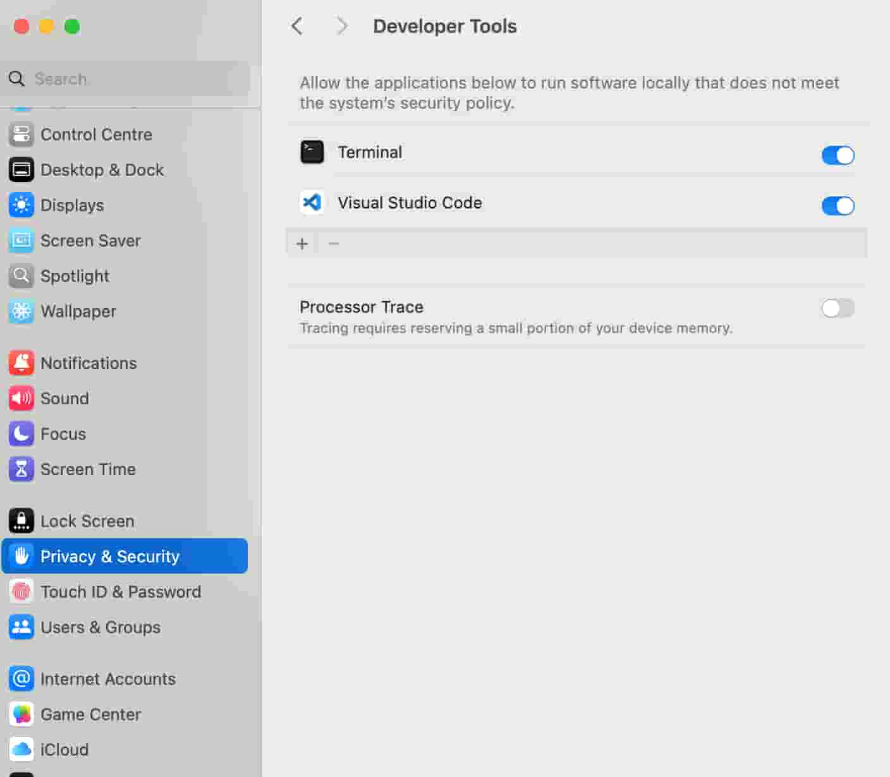

# Installation

Follow the steps below to install and run LPython on Linux, Windows or macOS.

## Prerequisites
- ### Install Conda
  Follow the instructions provided [here](https://github.com/conda-forge/miniforge/#download) to install Conda on your platform (Linux, macOS and Windows) using a conda-forge distribution called Miniforge.
  
  For Windows, these are additional requirements:
  - Miniforge Prompt
  - Visual Studio (with "Desktop Development with C++" workload)

- ### Set up your system
    - Linux
        - Run the following command to install some global build dependencies:

            ```bash
            sudo apt-get install build-essential binutils-dev clang zlib1g-dev
            ```
    - Windows
        - Download and install [Microsoft Visual Studio Community](https://visualstudio.microsoft.com/downloads/) for free.

        - Run the Visual Studio Installer. Download and install the "Desktop Development with C++" workload which will install the Visual C++ Compiler (MSVC).

        - Launch the Miniforge prompt from the Desktop. It is recommended to use MiniForge instead of Powershell as the main terminal to build and write code for LPython. In the MiniForge Prompt, initialize the MSVC compiler using the below command:

            ```bash
            call "C:\Program Files\Microsoft Visual Studio\2022\Community\Common7\Tools\VsDevCmd" -arch=x64
            ```

            You can optionally test MSVC via:

            ```bash
            cl /?
            link /?
            ```

            Both commands must print several pages of help text.

    - Windows with WSL
        - Install Miniforge Prompt and add it to path:
            ```bash
            wget  https://github.com/conda-forge/miniforge/releases/latest/download/Miniforge3-Linux-x86_64.sh -O miniconda.sh
            bash miniconda.sh -b -p $HOME/conda_root
            export PATH="$HOME/conda_root/bin:$PATH"
            conda init bash # (shell name)
            ```
        - Open a new terminal window and run the following commands to install dependencies:
            ```bash
            conda create -n lp -c conda-forge llvmdev=11.0.1 bison=3.4 re2c python cmake make toml clangdev git
            ```
        
        - Optionally, you can change the directory to a Windows location using `cd /mnt/[drive letter]/[windows location]`. For e.g. - `cd mnt/c/Users/name/source/repos/`.

    
- ### Clone the LPython repository
    Make sure you have `git` installed. Type the following command to clone the repository:

    ```bash
    git clone https://github.com/lcompilers/lpython.git
    cd lpython
    git submodule update --init
    ```
    
    You may also use GitHub Desktop to do the same.

## Building LPython
- ### Linux and macOS
    - Create a Conda environment:

        ```bash
        conda env create -f environment_unix.yml
        conda activate lp
        ```

    - Generate the prerequisite files and build in Debug Mode:

        ```bash
        # if you are developing on top of a forked repository; please run following command first
        # ./generate_default_tag.sh


        ./build0.sh
        ./build1.sh
        ```

- ### Windows
    - Create a Conda environment using the pre-existing file:

        ```bash
        conda env create -f environment_win.yml
        conda activate lp
        ```

    - Generate the prerequisite files and build in Release Mode:

        ```bash
        call build0.bat
        call build1.bat
        ```
- ### Windows with WSL

    - Activate the Conda environment:
        ```bash
        conda activate lp
        ```

    - Run the following commands to build the project:
        ```bash
        ./build0.sh
        cmake -DCMAKE_BUILD_TYPE=Debug -DWITH_LLVM=yes -DCMAKE_INSTALL_PREFIX=`pwd`/inst .\
        make -j8
        ```

## Tests

- ### Linux and macOS

    - Run tests:

        ```bash
        ctest
        ./run_tests.py
        ```

    - Update test references:
        ```
        ./run_tests.py -u
        ```

    - Run integration tests:

        ```bash
        cd integration_tests
        ./run_tests.py
        ```
    - In case you have recently updated macOS, you may get a warning like below in some test cases:
        ```bash
        ld: warning: object file (test_list_index2.out.tmp.o) was built for newer macOS version (14.0) than being linked (13.3)
        ```
        This leads to mismatch of hashes with expected output in some test cases, this can be resolved by updating command line tools:

        ```bash
        git clean -dfx
        sudo rm -rf /Library/Developer/CommandLineTools # make sure you know what you're doing here
        sudo xcode-select --install
        ./build.sh
        ./run_tests.py
        ```

    - Speed up Integration Tests on macOS

        Integration tests run slowly because Apple checks the hash of each
        executable online before running.

        You can turn off that feature in System Preferences > Privacy & Security > Developer Tools > Terminal.app > "allow the apps below to run software locally that does not meet the system's security policy.". After making this change, restart your terminal to ensure the changes take effect.

        Here is what it should look like:
        


- ### Windows

    - Run integration tests

        ```bash
        python run_tests.py --skip-run-with-dbg
        ```

    - Update reference tests

        ```bash
        python run_tests.py -u --skip-run-with-dbg
        ```

## Examples (Linux and macOS)

You can run the following examples manually in a terminal:

```bash
./src/bin/lpython examples/expr2.py
./src/bin/lpython examples/expr2.py -o expr
./expr
./src/bin/lpython --show-ast examples/expr2.py
./src/bin/lpython --show-asr examples/expr2.py
./src/bin/lpython --show-cpp examples/expr2.py
./src/bin/lpython --show-llvm examples/expr2.py
./src/bin/lpython --show-c examples/expr2.py
```

## Enabling the Jupyter Kernel

To install the Jupyter kernel, install the following Conda packages also:
```
conda install xeus=5.1.0 xeus-zmq=3.0.0 nlohmann_json
```
and enable the kernel by `-DWITH_XEUS=yes` and install into `$CONDA_PREFIX`. For
example:
```
cmake . -GNinja \
    -DCMAKE_BUILD_TYPE=Debug \
    -DWITH_LLVM=yes \
    -DWITH_XEUS=yes \
    -DCMAKE_PREFIX_PATH="$CONDA_PREFIX" \
    -DCMAKE_INSTALL_PREFIX="$CONDA_PREFIX"
    .
ninja install
```
To use it, install Jupyter (`conda install jupyter`) and test that the LPython
kernel was found:
```
jupyter kernelspec list --json
```
Then launch a Jupyter notebook as follows:
```
jupyter notebook
```
Click `New->LPython`. To launch a terminal jupyter LPython console:
```
jupyter console --kernel=lpython
```

## Found a bug?
Please report any bugs you find at our issue tracker [here](https://github.com/lcompilers/lpython/issues). Or, even better, fork the repository on GitHub and create a Pull Request (PR). 

We welcome all changes, big or small. We will help you make a PR if you are new to git.

If you have any questions or need help, please ask us at [Zulip](https://lfortran.zulipchat.com/) or on our [mailinglist](https://groups.io/g/lfortran).
